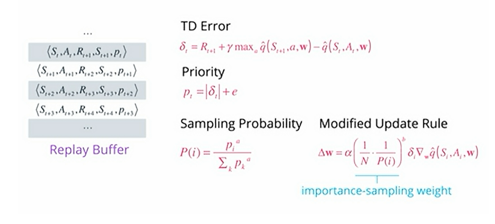
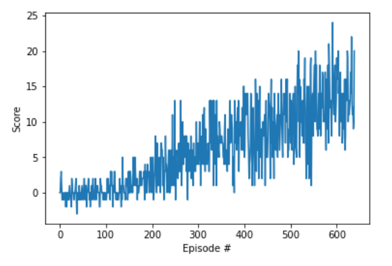

## Report
### Algorithm Introduction
In this project, we applied DQN(Deep Q-Learning) model-free algorithm, base on the paper [Human-level control through deep reinforcement learning](https://storage.googleapis.com/deepmind-media/dqn/DQNNaturePaper.pdf). 
DQN contains one deep neural network: Actor. The Actor is a policy network which takes the states as inputs and output each possible action (in discrete space) with corresponding Q state-action values.
Deep Q network is an off policy network. Off policy learning is when the policy used for interacting with the environment(action) is different than the policy being learned. 

To resolve neural function approximators having unstable problems, we have applied these methods:

1. Prioritized replay buffer to minimize correlations between samples and speed up training, base on the paper [PRIORITIZED EXPERIENCE REPLAY](https://arxiv.org/abs/1511.05952). Instead of uniformly random sampling minibatch of experiences, we sample with priorities and use importance sampling weight to adjust the distribution accordingly.

2. Double Q learning. Actor network has separate local network and target network, target network is to give consistent prediction while local network is to train and learn.
3. soft update. We update target network using TAU which is very small to change little by little from local network to improve stability of learning.
   $$\theta_{target} = \tau\theta_{local}  + (1-\tau)\theta_{target}$$
5. batch normalization. We using batch normalization to scale the features so thay are in similar ranges across environments and units. The technique normalize each dimension across the samples in a minibatch to have unit mean and variance.
6. update interval. Skipping some timesteps to learn the local network and update the target network.
7. epsilon greedy to action. Selecting a random action with probability epsilon. 

### Implementation

  **Highlevel pseudo-code of the algorithm**

    Init random weights for  target and local  actor.
    Init Prioritized replay memory
    
    foreach episode
        
        Get a initial state
        for each step in episode:
            Choose an action using actor policy with epsilon greedy
            Take action and observe the reward and next state
            Store the experience tuple in the replay buffer
    
            if we have enough experiences(batchsize) and every time step interval:
                Get a prioritized batchsize of tuples (s, a, r, s', done, indice, weight)
                Get max predicted Q values (for next states) from target model
                Compute Q targets for current states (y_i)
                Get expected Q values from local model(Q_expected)
                Compute loss(y_i and Q_expected)
                Adjust loss function: (loss+1e-5)*weights
                Minimize the actor loss
                update sampled experience priorities
                soft update actor target
                
                    
                
   **Hyperparameters**

        BUFFER_SIZE = int(1e5)  # replay buffer size
        BATCH_SIZE = 64         # minibatch size
        GAMMA = 0.99            # discount factor
        TAU = 1e-3              # for soft update of target parameters
        LR = 5e-4               # learning rate 
        UPDATE_EVERY = 4        # how often to learn and update the network
        BETA_START = 0.4        # hyper parameter for importance sampling weight
        BETA_END = 1.0          # 
        BETA_INCREASE = 8e-3    # beta increases to maximal 1.0
    
   **Neural Networks**

    We have actor network and its target clones.
     
    The architecture is multi-layer perceptrons, since we don't need handle pixel data. Input layer matches the state size then we have 2 hidden fully connected layers ,each layer followed by a batchnorm layer and finaly the output layer.
    
    
    Actors:
        state_size(37) * 64  * 64 --> output action_size values(size 4*1) 

### Code Structure

- p1_dpn_model.py contains the torch implementation of the Actor neural networks that are being used in the project.

- p1_dqn_agent.py contains the core of the project, such as agent.learn(),agent.step(),agent.act() and prioritized replay buffer

- Navigation.ipynb puts togheter all the pieces to build and train the agent.

### Result
After around 600 episodes the avg score_deque(100) get higher than 13

### Ideas for Future Work

To improve the agent's performance we can also try other DQN related improvements like Dueling DQN. We can also combine several methods like DDQN, Prioritized DDQN, Dueling DDQN, A3C, Noisy DQN into Rainbow,base on the paper [Rainbow: Combining Improvements in Deep Reinforcement Learning](https://arxiv.org/abs/1710.02298)
